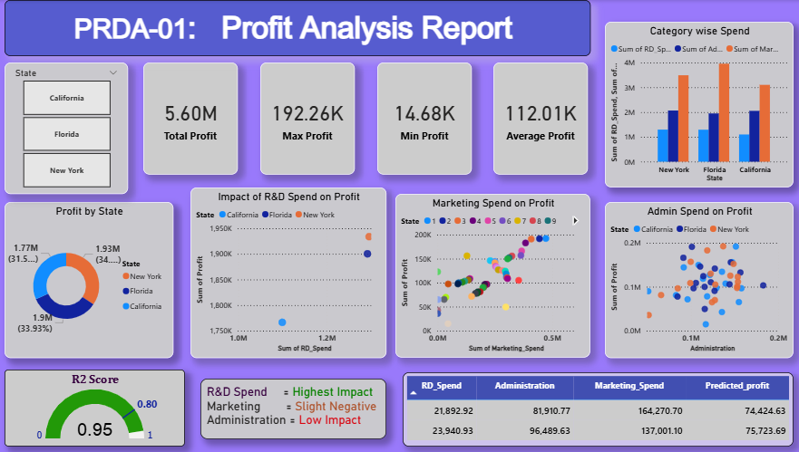

# 📊 Profit Analysis Project

## 📌 Overview
This project analyzes company profit based on R&D, Marketing, and Administration using data analysis techniques.

## 🛠 Tools Used
- SQL
- Power BI
- Excel

## 📈 Key Insights
- R&D has strong positive impact on profit
- Marketing also influences profit
- Data visualization helps identify trends

## 📊 Dashboard

## 📁 Files Included
- Dashboard screenshot
- Presentation (PPT)
- Dataset

## 🚀 Conclusion
This project helps understand how different factors affect profit and supports better business decisions.
